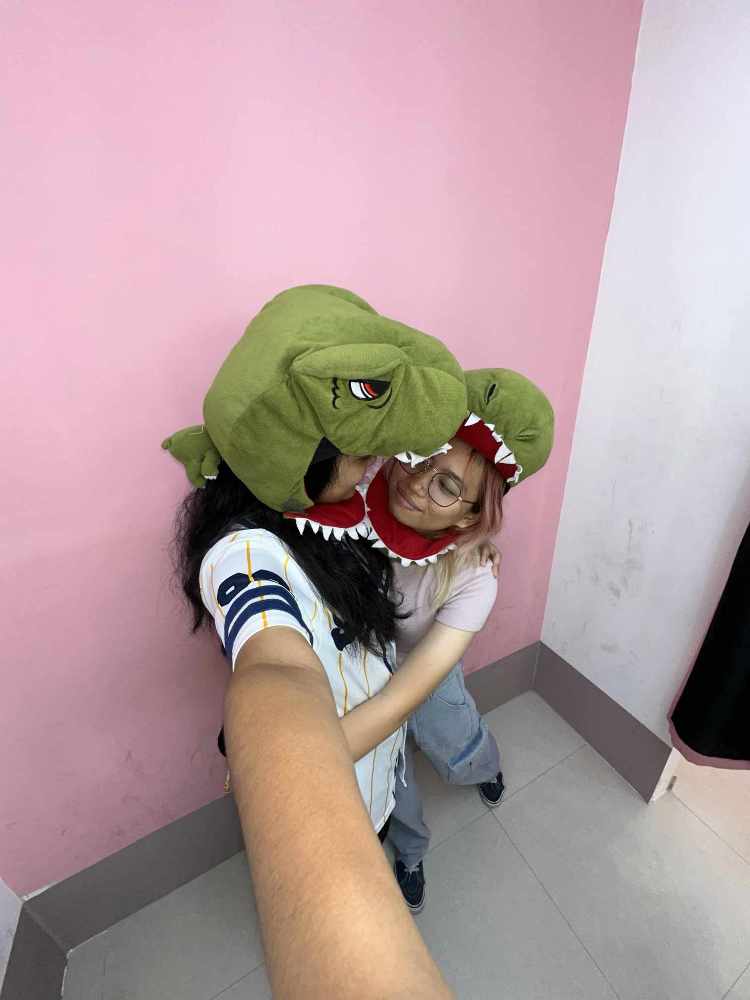
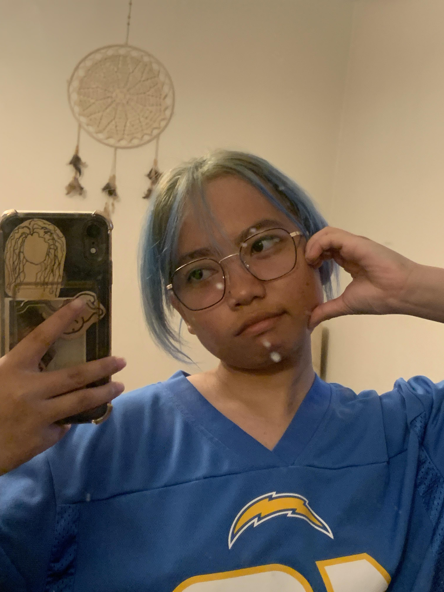
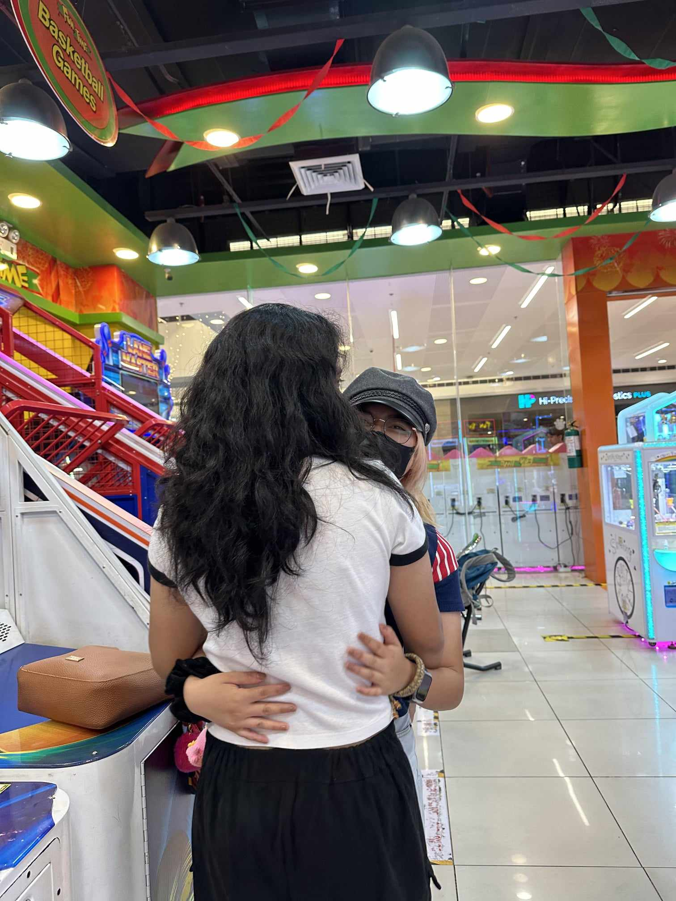
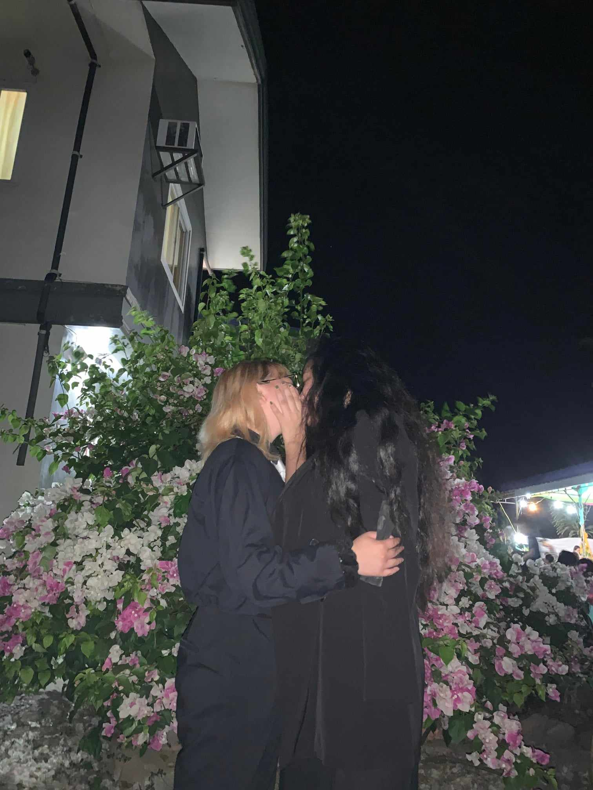
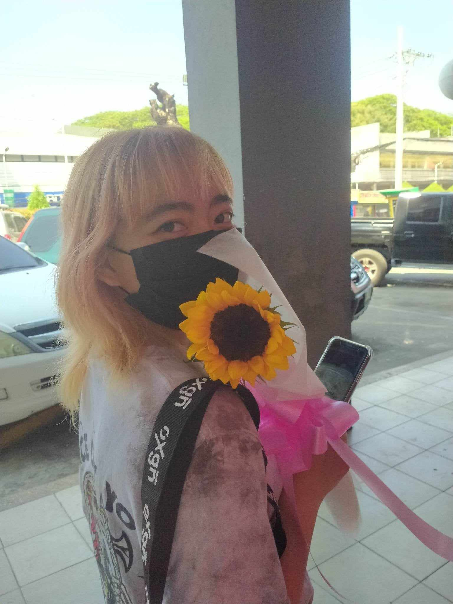

# love-letter-niko
<!DOCTYPE html>
<html lang="en">

<head>
  <meta charset="UTF-8">
  <meta name="viewport" content="width=device-width, initial-scale=1.0">
  <title>For Niko</title>
  
</head>

<body>
<h1>My Heart Belongs to You, Niko</h1>

  

    
    
My fave picture of us

  

  

    
    
Your photo that I love

  

  

    
    
Your hugs always warm me up

  

  

    
    
Your kisses never fail to make me feel loved

  

  

    
    
I love you so much

  

  

    
To My Niko,

    
Words can't express how much you mean to me. You're my sunshine, my confidante, my best friend, and the love of my life.

    
I don't wanna give up on life yet because I want to do more things with you sa future, getting a house or an apartment, doing laundry, cooking together, getting ready together, showering together.

    
Lahat na gusto ko gawin basta kasama ka. I always see you when I think about my future baby.

    
I know we'll struggle a lot, and that's okay because we have each other naman.

    
Thank you for being so patient with me, my love. You make me a better person, and I promise to spend every day showing you how much I cherish you.

    
I'm so thankful to have you. I love you so much, My Niko. Let's be together forever.

    
With all my love,

    
Jamie

  

</body>

</html>
